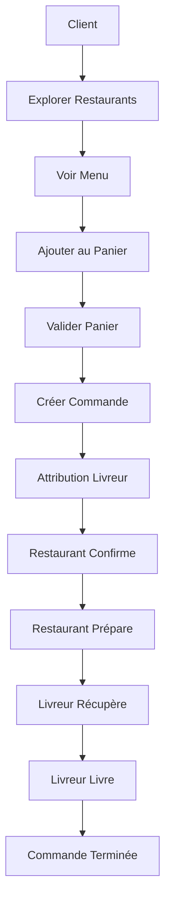

# 🍕 FouFouFood Server - API Backend

Application de livraison de repas avec système de commandes complet, gestion du panier virtuel, attribution des livreurs et notifications en temps réel.

## 📋 Table des Matières

- [Prérequis](#prérequis)
- [Installation](#installation)
- [Configuration des Services](#configuration-des-services)
- [Démarrage](#démarrage)
- [Vérification](#vérification)
- [Scripts Disponibles](#scripts-disponibles)
- [Tests](#tests)
- [API Documentation](#api-documentation)
- [Fonctionnalités](#fonctionnalités)
- [Structure du Projet](#structure-du-projet)
- [Workflow de Commande](#workflow-de-commande)
- [Scénarios de Test](#scénarios-de-test)

## 🔧 Prérequis

Avant de commencer, assurez-vous d'avoir installé les éléments suivants :

### Logiciels requis

- **Node.js** (version 18 ou supérieure)
  - Vérifier : `node --version`
  - Télécharger : [nodejs.org](https://nodejs.org/)
  
- **npm** (généralement inclus avec Node.js)
  - Vérifier : `npm --version`
  
- **MongoDB** (version 5 ou supérieure)
  - Option 1 : Installation locale - [mongodb.com](https://www.mongodb.com/try/download/community)
  - Option 2 : Docker (recommandé)
  
- **Redis** (version 6 ou supérieure)
  - Option 1 : Installation locale - [redis.io](https://redis.io/download)
  - Option 2 : Docker (recommandé)

### Outils optionnels (recommandés)

- **Docker Desktop** (pour MongoDB et Redis)
- **Postman** ou **Insomnia** (pour tester l'API)
- **Git** (pour cloner le projet)

## 🚀 Installation

### Étape 1 : Cloner le projet

```bash
git clone <repository-url>
cd foufoufood-server
```

### Étape 2 : Installer les dépendances

```bash
npm install
```

Cette commande installera toutes les dépendances listées dans `package.json`.

### Étape 3 : Configurer les variables d'environnement

Créez un fichier `.env` à la racine du projet avec les variables suivantes :

```env
# Environnement
NODE_ENV=development
PORT=3000

# Base de données MongoDB
MONGODB_URI=mongodb://localhost:27017/foufoufood

# Redis (cache et sessions)
REDIS_URL=redis://localhost:6379

# JWT (JSON Web Token)
JWT_SECRET=your-super-secret-jwt-key
JWT_EXPIRES_IN=24h

# Administrateur par défaut (créé automatiquement au démarrage)
ADMIN_NAME=Admin
ADMIN_EMAIL=admin@foufoufood.com
ADMIN_PASSWORD=admin123

# Configuration Email (optionnel - pour les notifications)
EMAIL_HOST=smtp.gmail.com
EMAIL_PORT=587
EMAIL_USER=your-email@gmail.com
EMAIL_PASS=your-app-password
EMAIL_FROM=noreply@foufoufood.com
```

## 🐳 Configuration des Services

### Option 1 : Installation avec Docker (Recommandé)

#### MongoDB
```bash
# Créer et démarrer le conteneur MongoDB
docker run -d --name mongodb -p 27017:27017 mongo:latest

# Vérifier que le conteneur est démarré
docker ps | grep mongodb
```

#### Redis
```bash
# Créer et démarrer le conteneur Redis avec persistance
docker run -d --name redis-local -p 6379:6379 -v redis-data:/data redis:7 redis-server --appendonly yes

# Vérifier que le conteneur est démarré
docker ps | grep redis
```

**Commandes utiles Docker :**
```bash
# Démarrer les conteneurs
docker start mongodb redis-local

# Arrêter les conteneurs
docker stop mongodb redis-local

# Voir les logs
docker logs mongodb
docker logs redis-local

# Supprimer les conteneurs (⚠️ supprime les données)
docker rm mongodb redis-local
```

### Option 2 : Installation locale

#### MongoDB
1. Télécharger MongoDB depuis [mongodb.com](https://www.mongodb.com/try/download/community)
2. Installer selon votre système d'exploitation
3. Démarrer le service MongoDB :
   ```bash
   # Windows (via Services)
   # Linux/Mac
   sudo systemctl start mongod
   # ou
   mongod
   ```

#### Redis
1. Télécharger Redis depuis [redis.io](https://redis.io/download)
2. Installer selon votre système d'exploitation
3. Démarrer Redis :
   ```bash
   # Windows (via Redis MSI installer)
   # Linux/Mac
   redis-server
   ```

## ▶️ Démarrage

### Étape 1 : Démarrer les services (MongoDB et Redis)

**Si vous utilisez Docker :**
```bash
docker start mongodb redis-local
```

**Si vous utilisez des installations locales :**
- Assurez-vous que MongoDB et Redis sont démarrés
- MongoDB doit être accessible sur `mongodb://localhost:27017`
- Redis doit être accessible sur `redis://localhost:6379`

### Étape 2 : Démarrer le serveur

```bash
npm start
```

Ou en mode développement avec rechargement automatique :
```bash
npm run dev
```

**Ce qui se passe au démarrage :**
1. ✅ Connexion à MongoDB
2. ✅ Connexion à Redis
3. ✅ Création de l'administrateur par défaut (si n'existe pas)
4. ✅ Initialisation du serveur WebSocket pour les notifications
5. ✅ Serveur démarré sur `http://localhost:3000`

**Messages attendus :**
```
Foufoufood server is running on http://localhost:3000
WebSocket server is running for real-time notifications
Connect to database in development mode
Connected to Redis
Platform admin created successfully!
```

## ✅ Vérification

### Vérifier que le serveur fonctionne

1. **Test de base :**
```bash
curl http://localhost:3000/
```
Réponse attendue : `Welcome to foufoufood server API !`

2. **Test de l'API :**
```bash
curl http://localhost:3000/foufoufood/restaurants
```
Réponse attendue : Liste JSON des restaurants (peut être vide si aucune donnée)

## 📜 Scripts Disponibles

| Script | Description |
|--------|-------------|
| `npm start` | Démarre le serveur avec nodemon (rechargement automatique) |
| `npm run dev` | Alias de `npm start` |
| `npm test` | Exécute les tests unitaires avec Jest |
| `npm run lint` | Vérifie le code avec ESLint |
| `npm run lint:fix` | Corrige automatiquement les erreurs ESLint |

## 🧪 Tests

### Tests Automatisés

Les tests unitaires sont situés dans le dossier `tests/` et utilisent Jest.

```bash
# Exécuter tous les tests unitaires
npm test

# Exécuter un test spécifique
npm test -- tests/order.test.js
npm test -- tests/auth.test.js
npm test -- tests/restaurant.test.js
npm test -- tests/cart.test.js
npm test -- tests/menu.test.js
npm test -- tests/user.test.js
npm test -- tests/admin.test.js
```

### Tests Manuels

#### **Avec Postman/Insomnia**

**Collection Postman disponible :** `postman/foufoufood.postman_collection.json`

**Endpoints principaux :**
- `POST /foufoufood/auth/sign-up` - Inscription
- `POST /foufoufood/auth/sign-in` - Connexion
- `GET /foufoufood/restaurants` - Liste des restaurants
- `GET /foufoufood/menus?restaurantId=ID` - Menu d'un restaurant
- `POST /foufoufood/cart/items` - Ajouter au panier
- `GET /foufoufood/cart` - Voir le panier
- `POST /foufoufood/orders` - Créer une commande


## 📚 API Documentation

### Base URL
Toutes les routes sont préfixées par `/foufoufood`

**Exemple :** `http://localhost:3000/foufoufood/auth/sign-in`

### 🔐 Authentification

| Méthode | Endpoint | Description | Rôle |
|---------|----------|-------------|------|
| `POST` | `/foufoufood/auth/sign-up` | Inscription d'un nouvel utilisateur | public |
| `POST` | `/foufoufood/auth/sign-in` | Connexion | public |
| `POST` | `/foufoufood/auth/sign-out` | Déconnexion | tous |

**Rôles disponibles :** `client`, `delivery_partner`, `restaurant_admin`, `platform_admin`

### 🛒 Gestion du Panier

| Méthode | Endpoint | Description | Rôle |
|---------|----------|-------------|------|
| `GET` | `/foufoufood/cart` | Récupérer le panier | client |
| `POST` | `/foufoufood/cart/items` | Ajouter un article | client |
| `PUT` | `/foufoufood/cart/items/:id` | Modifier la quantité | client |
| `DELETE` | `/foufoufood/cart/items/:id` | Supprimer un article | client |
| `DELETE` | `/foufoufood/cart` | Vider le panier | client |
| `POST` | `/foufoufood/cart/validate` | Valider le panier | client |

### 📋 Gestion des Commandes

| Méthode | Endpoint | Description | Rôle |
|---------|----------|-------------|------|
| `POST` | `/foufoufood/orders` | Créer une commande | client |
| `GET` | `/foufoufood/orders` | Mes commandes | client |
| `GET` | `/foufoufood/orders/:id` | Détails d'une commande | client/delivery/admin |
| `PUT` | `/foufoufood/orders/:id/status` | Mettre à jour le statut | restaurant/delivery/admin |
| `PUT` | `/foufoufood/orders/:id/cancel` | Annuler une commande | client |
| `GET` | `/foufoufood/orders/delivery/available` | Commandes disponibles | delivery_partner |
| `POST` | `/foufoufood/orders/:id/assign` | S'assigner une commande | delivery_partner |

### 🏪 Restaurants et Menus

| Méthode | Endpoint | Description | Rôle |
|---------|----------|-------------|------|
| `GET` | `/foufoufood/restaurants` | Liste des restaurants | public |
| `GET` | `/foufoufood/restaurants/search` | Rechercher des restaurants | public |
| `GET` | `/foufoufood/restaurants/:id` | Détails d'un restaurant | public |
| `GET` | `/foufoufood/restaurants/my/restaurants` | Mes restaurants | restaurant_admin |
| `POST` | `/foufoufood/restaurants` | Créer un restaurant | restaurant_admin |
| `PUT` | `/foufoufood/restaurants/:id` | Modifier un restaurant | restaurant_admin |
| `DELETE` | `/foufoufood/restaurants/:id` | Supprimer un restaurant | restaurant_admin/platform_admin |
| `POST` | `/foufoufood/restaurants/:id/reviews` | Ajouter un avis | client |
| `DELETE` | `/foufoufood/restaurants/:id/reviews` | Supprimer un avis | client |
| `GET` | `/foufoufood/menus?restaurantId=ID` | Menu d'un restaurant | public |
| `GET` | `/foufoufood/menus/:id` | Détails d'un item | public |
| `POST` | `/foufoufood/menus` | Ajouter un item au menu | restaurant_admin |
| `PUT` | `/foufoufood/menus/:id` | Modifier un item | restaurant_admin |
| `DELETE` | `/foufoufood/menus/:id` | Supprimer un item | restaurant_admin |

### 👥 Gestion des Utilisateurs

| Méthode | Endpoint | Description | Rôle |
|---------|----------|-------------|------|
| `GET` | `/foufoufood/users/me` | Mon profil | tous |
| `PUT` | `/foufoufood/users/me` | Modifier mon profil | tous |
| `DELETE` | `/foufoufood/users/me` | Supprimer mon compte | tous |
| `GET` | `/foufoufood/users` | Liste des utilisateurs | platform_admin |
| `GET` | `/foufoufood/users/:id` | Détails d'un utilisateur | platform_admin |

### 🔔 Notifications

| Méthode | Endpoint | Description | Rôle |
|---------|----------|-------------|------|
| `GET` | `/foufoufood/notifications` | Mes notifications | tous |
| `PUT` | `/foufoufood/notifications/:id/read` | Marquer comme lu | tous |

**WebSocket :** Les notifications sont également disponibles en temps réel via WebSocket sur `/foufoufood/notifications`

## 🌐 Web Sémantique

L'application expose une API web sémantique accessible à `/data` qui permet de consulter les données de l'application dans un format structuré et machine-readable.

### Formats Supportés

L'API supporte deux formats selon l'en-tête HTTP `Accept` :

- **`text/html`** : Pages HTML lisibles par l'humain avec présentation des données
- **`application/ld+json`** : Documents JSON-LD (JSON for Linking Data) pour le web sémantique

### Base URL

Toutes les routes du web sémantique sont préfixées par `/data`

**Exemple :** `http://localhost:3000/data`

### Routes Disponibles

| Méthode | Endpoint | Description | Format |
|---------|----------|-------------|--------|
| `GET` | `/data` | Page d'accueil avec documentation de l'API | HTML / JSON-LD |
| `GET` | `/data/restaurants` | Liste de tous les restaurants | HTML / JSON-LD |
| `GET` | `/data/restaurants/:id` | Détails d'un restaurant spécifique | HTML / JSON-LD |
| `GET` | `/data/restaurants/:id/menu` | Menu d'un restaurant spécifique | HTML / JSON-LD |
| `GET` | `/data/menus` | Liste de tous les items de menu | HTML / JSON-LD |
| `GET` | `/data/menus/:id` | Détails d'un item de menu spécifique | HTML / JSON-LD |
| `GET` | `/data/orders` | Liste de toutes les commandes | HTML / JSON-LD |
| `GET` | `/data/orders/:id` | Détails d'une commande spécifique | HTML / JSON-LD |

### Utilisation

#### Consulter la Documentation HTML

Ouvrez simplement dans votre navigateur :
```
http://localhost:3000/data
```

#### Récupérer les Données en JSON-LD

**Avec PowerShell :**
```powershell
# Utiliser curl.exe (pas curl qui est un alias)
curl.exe -H "Accept: application/ld+json" http://localhost:3000/data

# Ou avec Invoke-WebRequest
Invoke-WebRequest -Uri http://localhost:3000/data -Headers @{"Accept"="application/ld+json"} | Select-Object -ExpandProperty Content

# Ou avec Invoke-RestMethod (retourne directement l'objet JSON)
Invoke-RestMethod -Uri http://localhost:3000/data -Headers @{"Accept"="application/ld+json"}
```

**Avec curl (Linux/Mac) :**
```bash
curl -H "Accept: application/ld+json" http://localhost:3000/data
```

**Exemples de Requêtes :**

```powershell
# Liste des restaurants en JSON-LD
curl.exe -H "Accept: application/ld+json" http://localhost:3000/data/restaurants

# Détails d'un restaurant (remplacer :id par un ID réel)
curl.exe -H "Accept: application/ld+json" http://localhost:3000/data/restaurants/:id

# Menu d'un restaurant
curl.exe -H "Accept: application/ld+json" http://localhost:3000/data/restaurants/:id/menu

# Liste des items de menu
curl.exe -H "Accept: application/ld+json" http://localhost:3000/data/menus

# Détails d'un item de menu
curl.exe -H "Accept: application/ld+json" http://localhost:3000/data/menus/:id

# Liste des commandes
curl.exe -H "Accept: application/ld+json" http://localhost:3000/data/orders

# Détails d'une commande
curl.exe -H "Accept: application/ld+json" http://localhost:3000/data/orders/:id
```

### Format JSON-LD

Les données sont structurées selon le vocabulaire **Schema.org** :

- **Restaurants** : Utilisent le type `Restaurant` de Schema.org
- **Items de Menu** : Utilisent le type `MenuItem` de Schema.org
- **Commandes** : Utilisent le type `Order` de Schema.org

Chaque entité inclut :
- Un `@context` pointant vers Schema.org
- Un `@type` spécifiant le type de l'entité
- Un `@id` avec l'URL unique de la ressource
- Les propriétés pertinentes selon Schema.org

### Exemple de Document JSON-LD

```json
{
  "@context": "https://schema.org",
  "@type": "Restaurant",
  "@id": "http://localhost:3000/data/restaurants/507f1f77bcf86cd799439011",
  "name": "Pizzeria Mario",
  "address": {
    "@type": "PostalAddress",
    "streetAddress": "123 Rue de la Pizza",
    "addressLocality": "Montréal",
    "postalCode": "H1A 1A1"
  },
  "servesCuisine": "Italian",
  "priceRange": "$$"
}
```

### Détection Automatique du Format

L'API détecte automatiquement le format demandé via l'en-tête HTTP `Accept` :
- Si `Accept` contient `application/ld+json` → Retourne JSON-LD
- Sinon → Retourne HTML par défaut

## 🎯 Fonctionnalités

### ✅ Fonctionnalités Implémentées

#### 🔐 Authentification et Sécurité
- Authentification JWT avec gestion des sessions via Redis
- 4 rôles utilisateurs : `client`, `delivery_partner`, `restaurant_admin`, `platform_admin`
- Protection des routes avec middleware d'authentification
- Hashage des mots de passe avec bcrypt

#### 👥 Gestion des Utilisateurs
- Inscription et connexion
- Gestion du profil utilisateur (CRUD)
- Création automatique de l'administrateur par défaut au démarrage
- Gestion des adresses utilisateur

#### 🏪 Gestion des Restaurants
- CRUD complet pour les restaurants (restaurant_admin)
- Consultation publique des restaurants
- Recherche de restaurants
- Système de notation et d'avis par les clients
- Affichage des notes moyennes et des avis

#### 🍽️ Gestion des Menus
- CRUD complet pour les items de menu (restaurant_admin)
- Consultation publique des menus
- Catégorisation des plats

#### 🛒 Panier Virtuel
- Stockage dans Redis pour performance
- Validation automatique des items
- Gestion des quantités
- Calcul automatique du total

#### 📋 Système de Commandes
- Création de commandes depuis le panier
- Suivi des statuts : `En attente`, `Confirmée`, `Préparée`, `En livraison`, `Livrée`, `Annulée`
- Attribution manuelle des livreurs
- Gestion des permissions par rôle

#### 🚚 Gestion des Livreurs
- Attribution de commandes aux livreurs
- Visualisation des commandes disponibles
- Mise à jour du statut de livraison
- Affichage du nom du livreur dans les commandes

#### 🔔 Notifications
- Notifications en temps réel via WebSocket
- Notifications par email (optionnel)
- Historique des notifications

#### 🌐 Web Sémantique
- API web sémantique accessible à `/data`
- Support de deux formats : HTML (lisible) et JSON-LD (machine-readable)
- Détection automatique du format via l'en-tête HTTP `Accept`
- Structuration des données selon le vocabulaire Schema.org
- Documentation intégrée dans la page d'accueil HTML

#### 📊 Autres Fonctionnalités
- API REST complète
- Gestion centralisée des erreurs
- Logs détaillés
- Support des tests unitaires et d'intégration

## 📁 Structure du Projet

```
foufoufood-server/
├── 📁 config/                 # Configuration
│   ├── db.js                  # Base de données MongoDB
│   ├── redis.js               # Cache Redis
│   └── env.js                 # Variables d'environnement
├── 📁 controllers/            # Contrôleurs API
│   ├── admin.controller.js    # Administration de la plateforme
│   ├── auth.controller.js     # Authentification
│   ├── cart.controller.js     # Panier virtuel
│   ├── data.controller.js     # API Web Sémantique (/data)
│   ├── menu.controller.js     # Menus
│   ├── notification.controller.js # Notifications
│   ├── order.controller.js    # Commandes
│   ├── restaurant.controller.js # Restaurants
│   ├── tracking.controller.js # Suivi des commandes
│   └── user.controller.js     # Utilisateurs
├── 📁 services/               # Logique métier
│   ├── admin.service.js       # Service d'administration
│   ├── auth.service.js        # Service d'authentification
│   ├── cart.service.js        # Service du panier
│   ├── email.service.js       # Service d'envoi d'emails
│   ├── notification.service.js # Service de notifications
│   ├── order.service.js        # Service des commandes
│   ├── semantic.service.js     # Service Web Sémantique (JSON-LD)
│   └── user.service.js        # Service des utilisateurs
├── 📁 models/                 # Modèles de données
│   ├── user.model.js          # Utilisateurs
│   ├── restaurant.model.js    # Restaurants
│   ├── menu.model.js          # Items de menu
│   ├── order.model.js         # Commandes
│   └── deliveryPartner.model.js # Livreurs
├── 📁 routes/                 # Routes API
│   ├── admin.routes.js        # Routes d'administration
│   ├── auth.routes.js         # Routes d'authentification
│   ├── cart.routes.js         # Routes du panier
│   ├── menu.routes.js         # Routes des menus
│   ├── notification.routes.js # Routes des notifications
│   ├── order.routes.js        # Routes des commandes
│   ├── restaurant.routes.js   # Routes des restaurants
│   ├── data.routes.js         # Routes Web Sémantique (/data)
│   ├── tracking.routes.js     # Routes de suivi
│   └── user.routes.js         # Routes des utilisateurs
├── 📁 middlewares/            # Middlewares
│   ├── auth.middleware.js     # Authentification
│   ├── error.middleware.js    # Gestion d'erreurs
│   └── mime.middleware.js     # Détection du format (HTML/JSON-LD)
├── 📁 tests/                  # Tests unitaires (Jest)
│   ├── admin.test.js         # Tests de l'administration
│   ├── auth.test.js          # Tests d'authentification
│   ├── cart.test.js          # Tests du panier
│   ├── menu.test.js          # Tests des menus
│   ├── order.test.js         # Tests des commandes
│   ├── restaurant.test.js    # Tests des restaurants
│   ├── user.test.js          # Tests des utilisateurs
│   ├── setup.js              # Configuration des tests
│   ├── helpers.js            # Fonctions utilitaires pour les tests
│   └── README.md             # Documentation des tests
├── 📁 postman/                # Collection Postman
│   ├── foufoufood.postman_collection.json
│   └── README.md             # Documentation Postman
├── 📄 app.js                  # Point d'entrée de l'application
├── 📄 seedAdmin.js            # Script de création de l'admin par défaut
├── 📄 package.json            # Dépendances et scripts npm
├── 📄 package-lock.json       # Verrouillage des versions des dépendances
├── 📄 jest.config.cjs         # Configuration Jest pour les tests
├── 📄 eslint.config.js        # Configuration ESLint pour le linting
├── 📄 .gitignore             # Fichiers ignorés par Git
└── 📄 README.md               # Documentation principale
```

## 🔄 Workflow de Commande



## 🧪 Scénarios de Test

### **Scénario 1 : Commande Complète**
1. Créer un client
2. Explorer les restaurants
3. Ajouter des articles au panier
4. Valider le panier
5. Créer une commande
6. Vérifier l'attribution du livreur

### **Scénario 2 : Gestion Restaurant**
1. Créer un admin restaurant
2. Créer un restaurant
3. Ajouter des items au menu
4. Voir les commandes
5. Mettre à jour les statuts

### **Scénario 3 : Livraison**
1. Créer un partenaire de livraison
2. Voir les commandes disponibles
3. S'assigner une commande
4. Marquer comme livrée

# Foufoufood
